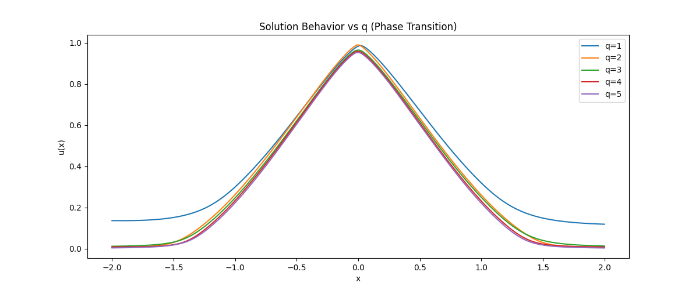

# Liouville-Type Results for Infinity Elliptic Equations with Gradient and Hardy–Hénon Nonlinearities

> A dimension-free Liouville theory for the infinity Laplacian, identifying the sharp critical threshold **p = 3** arising from its intrinsic cubic scaling structure.

---

## 📌 Overview

This repository contains a research project developed at the Vietnam Institute for Advanced Study in Mathematics (VIASM) during the Summer 2025 Research Fellowship.

We study Liouville-type nonexistence phenomena for a class of highly degenerate elliptic equations of the form:

```
-Δ∞u + c|∇u|^q = λ|x|^a u^p   in ℝⁿ
```

involving:

* the **infinity Laplacian** Δ∞
* **gradient-dependent nonlinearities**
* **Hardy–Hénon-type spatial weights**

Our goal is to understand how degeneracy, gradient effects, and spatial heterogeneity interact to determine global solution behavior.

---

## 🔥 Core Mechanism

The key structural feature of the infinity Laplacian is its **cubic homogeneity**:

```
Δ∞(τu) = τ³ Δ∞u
```

This induces a rigid scaling constraint for equations of the form:

```
-Δ∞u = |x|^a u^p
```

leading to the balance relation:

```
θ(p - 3) = a + 4
```

As a consequence:

* the exponent **p = 3** emerges as a **critical threshold**
* this threshold is **independent of the spatial dimension**
* subcritical regimes (p ≤ 3) are incompatible with decaying entire solutions

---

## ⭐ Main Results (Informal)

* **Liouville Nonexistence**
  If `1 < p ≤ 3`, any bounded nonnegative viscosity solution is trivial

* **Gradient Domination**
  If `q > 3` and `p < q`, the gradient term dominates and enforces triviality

* **Critical Thresholds**
  Both `p = 3` and `q = 3` arise from the cubic structure of Δ∞

* **Dimension-Free Behavior**
  The critical exponent does not depend on dimension

---

## 🎯 Problem Statement

We investigate nonlinear PDEs of the form:

```
-Δ∞u + c|∇u|^q = λ|x|^a u^p   in ℝⁿ
```

Key questions:

* When do nontrivial entire solutions exist?
* How do gradient nonlinearities alter Liouville theory?
* What is the role of spatial weights?

---

## 🧠 Main Contributions

* Identification of a **dimension-independent critical exponent p = 3**
* Discovery of a **gradient domination threshold q = 3**
* Development of:

  * scaling arguments
  * radial reduction
  * viscosity solution framework
* Extension to:

  * gradient-dependent equations
  * Hardy–Hénon weights

---

## 🔬 Numerical Verification (PINN)

To complement the theoretical analysis, we implement a **Physics-Informed Neural Network (PINN)** to approximate solutions of the PDE:

-Δ∞u + c|∇u|^q = λ|x|^a u^p

### Key Observations

- **Phase Transition at q = 3**  
  The numerical solutions exhibit a clear transition from diffusion-dominated to gradient-dominated regimes as q increases.

- **Near-Trivial Collapse for Large q**  
  For q > 3, solutions progressively flatten and approach near-trivial states, consistent with the Liouville-type nonexistence mechanism.

- **Scaling Behavior**  
  Numerical estimates of the decay exponent β are broadly consistent with the theoretical scaling predictions derived from the cubic structure of the infinity Laplacian.

---

### Example Results

#### Phase Transition


#### Norm Convergence


---

### Run the Code

```bash
pip install -r requirements.txt
python src/experiment.py
```bash
---

## 📚 Relation to Existing Work

This work builds upon:

* Gidas–Spruck (semilinear elliptic equations)
* Hardy–Hénon equations
* Infinity Laplacian / AMLE (Aronsson, Jensen, Crandall–Lions)

We extend these to a **fully nonlinear, non-divergence setting** with gradient effects and weights.

---

## 📄 Paper

📥 **Full manuscript:**
[Download PDF](paper/liouville_infinity_elliptic_equations.pdf)

The LaTeX source is included for reproducibility.

## 📊 Presentation

🎥 **Slides:**  
[View Slides](./slides/liouville_infinity_pde_slides.pdf)

The presentation summarizes the main ideas, methods, and results of the paper.

---

## 🧩 Conceptual Structure


The diagram illustrates the interaction between:

* cubic diffusion (Δ∞)
* gradient nonlinearity (`|∇u|^q`)
* spatial forcing (`|x|^a u^p`)

→ leading to a critical transition at **p = 3**

---

## 🔗 Interdisciplinary Insight

The infinity Laplacian corresponds to **absolutely minimizing Lipschitz extensions (AMLE)**.

Connections to:

### PDE Theory

* degenerate elliptic operators
* viscosity solutions
* Liouville-type rigidity

### Machine Learning

* Lipschitz regularization
* adversarial robustness
* gradient penalties

When gradient penalization is too strong (`q > 3`), the system collapses → analogous to **model collapse** in deep learning.

---

## 🚀 Future Directions

* Parabolic (time-dependent) extensions
* Boundary value problems in weighted settings
* Anisotropic or non-radial weights
* Connections with stochastic control (tug-of-war games)

---

## ❓ Open Problems

* Classification of sign-changing (nodal) solutions
* Sharp thresholds in mixed nonlinear regimes
* Stability under perturbations
* PDE–probability connections

---

## ⚠️ Status

This is an ongoing research project.
Some results are being refined toward full mathematical rigor and potential publication.

---

## 👨‍🏫 Advisors

* Prof. Hai-Long Dao (University of Kansas)
* Prof. Dac-Tuan Ngo (CNRS)
* Dr. Tuan-Minh Nguyen (Monash University)

---

## 👤 Authors

**Tran Minh Hau**
University of Information Technology – VNU-HCM

**Huynh Trung Hieu**
Ho Chi Minh City University of Education (HCMUE)

---

## 📬 Contact

* [hautm.cs@gmail.com](mailto:hautm.cs@gmail.com)
* [hthieu.ue@gmail.com](mailto:hthieu.ue@gmail.com)

---

## 📚 Notes

* [Intuition](notes/intuition.md)
* [Sketch Proofs](notes/sketch_proofs.md)
